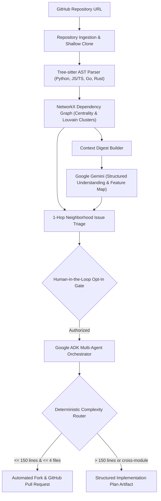

# Flux

Autonomous open-source onboarding and agentic issue resolution powered by Tree-sitter AST analysis, NetworkX graph theory, Google Gemini, and the Google Agent Development Kit (ADK).

---

## Executive Summary

New contributors to open-source projects face steep cognitive friction when parsing complex codebases, mapping issue tickets to concrete source files, and verifying architectural invariants before contributing.

Flux provides an end-to-end pipeline that transforms any GitHub repository into an interactive structural dependency graph, generates grounded architectural summaries, pinpoints issue neighborhoods, and executes autonomous pull requests or structured implementation plans through a coordinated multi-agent system.

---

## Key Differentiators and Architectural Strengths

### 1. Multi-Language AST Parsing via Tree-sitter
- Extracts concrete syntax trees (CST/AST) across Python, JavaScript, TypeScript, Go, and Rust.
- Identifies file-level imports, functions, classes, and exported symbols without executing code.
- Eliminates regex heuristics in favor of deterministic grammar-based parsing.

### 2. Graph-Theoretic Codebase Modeling with NetworkX
- Constructs a directed dependency graph representing import and invocation topologies.
- Computes centrality metrics (in-degree, out-degree, degree centrality) to identify core architectural backbone files.
- Applies Louvain community detection to automatically segment the codebase into functional clusters and modular boundaries.

### 3. Grounded LLM Synthesis via Google Gemini
- Uses Google GenAI SDK (`defaults to:gemini-3.5-flash-lite`) with strict Pydantic structured schemas.
- Ingests structured graph digests rather than raw unstructured code dumps, keeping token usage efficient and context grounded.
- Features deterministic fallbacks ensuring offline resilience and reliability.

### 4. 1-Hop Graph Neighborhood Issue Triage
- Correlates issue descriptions with AST symbols and dependency paths.
- Isolates 1-hop inbound and outbound neighbors around suspect files to prevent regressions.
- Translates technical bugs into plain-English explanations, real-world analogies, and actionable implementation checklists.

### 5. Hierarchical Multi-Agent System (Google ADK)
- **Coordinator Agent**: Central dispatcher managing conversational turns and delegating specialized tasks.
- **Summarizer Agent**: Generates architectural summaries, tech stack identification, and execution flows.
- **Issue Explainer Agent**: Performs grounded issue localization and dependency-aware triage.
- **Orchestrator Agent**: Executes code modifications with Human-in-the-Loop authorization.

### 6. Deterministic Complexity Routing
- Enforces an upfront complexity gate to distinguish between contained bug fixes and broad architectural refactors.
- **Contained Diffs (<= 150 lines, <= 4 files)**: Clones/forks the repository, applies patches, validates changes, and publishes a cross-repository GitHub Pull Request.
- **Complex Diffs (> 150 lines or cross-module refactors)**: Generates a comprehensive Implementation Plan Artifact containing affected modules, migration strategy, and testing guidelines.

---

## System Architecture




---

## Tech Stack

- **Backend**: Python 3.12, FastAPI, Uvicorn, SQLite
- **Agent Framework**: Google ADK (`google-adk`)
- **LLM & SDK**: Google Gemini (`gemini-3.5-flash-lite` via `google-genai`)
- **Parsing & Graphs**: Tree-sitter (Python, JS/TS, Go, Rust), NetworkX, python-louvain
- **Frontend**: Next.js 16, React 19, TypeScript, Tailwind CSS 4, Lucide React
- **VCS & Integrations**: GitHub REST API v3, Git CLI

---

## Repository Structure

```text
flux/
├── backend/
│   ├── main.py                     # FastAPI application entrypoint
│   ├── config.py                   # Central configuration and settings
│   ├── requirements.txt            # Python dependencies
│   ├── agent/                      # Google ADK multi-agent package
│   │   ├── coordinator.py          # flux_root coordinator agent
│   │   ├── runner.py               # Interactive agent runner and handoff engine
│   │   ├── agents/                 # Specialized ADK subagents
│   │   ├── tools/                  # ADK function tools
│   │   └── workflow/               # Complexity router and handoff workflows
│   ├── api/                        # REST API endpoints
│   ├── models/                     # SQLite database models and Pydantic schemas
│   ├── services/                   # AST parser, graph builder, and LLM services
│   ├── tests/                      # Consolidated automated test suite
│   └── workspaces/                 # Local repository working directory
├── frontend/
│   ├── app/
│   │   ├── page.tsx                # Main dashboard application
│   │   ├── components/             # React UI components
│   │   └── lib/api.ts              # Typed backend API client
│   └── package.json
├── AGENTS.md                       # Agent development and commenting rules
└── README.md                       # Project documentation
```

---

## Getting Started

### Prerequisites

- Python 3.12 or higher
- Node.js 18 or higher (with npm)
- Git CLI

### 1. Environment Configuration

Create a `.env` file in the project root:

```bash
cp .env.example .env
```

Configure your environment variables:

```ini
GEMINI_API_KEY=your_gemini_api_key_here
GEMINI_MODEL=gemini-3.5-flash-lite
GITHUB_TOKEN=your_github_personal_access_token_here
```

### 2. Backend Setup

```bash
cd backend
python -m venv .venv

# On Windows
.\.venv\Scripts\activate
# On Linux / macOS
source .venv/bin/activate

pip install -r requirements.txt
uvicorn main:app --reload --host 127.0.0.1 --port 8000
```

API Documentation:
- Swagger UI: `http://127.0.0.1:8000/docs`
- Health Endpoint: `http://127.0.0.1:8000/api/health`

### 3. Frontend Setup

In a separate terminal:

```bash
cd frontend
npm install
npm run dev
```

The application will be available at `http://localhost:3000`.

---

## Verification and Testing

The backend includes a consolidated automated test suite:

```bash
cd backend
.\.venv\Scripts\pytest -v
```

Individual test modules:
- `pytest tests/test_api.py -v`: REST API endpoints and health checks.
- `pytest tests/test_services.py -v`: AST parsing, NetworkX graph modeling, and issue triage services.
- `pytest tests/test_agent.py -v`: Google ADK multi-agent coordination, complexity routing, and handoff execution.

---

## License

MIT License.
